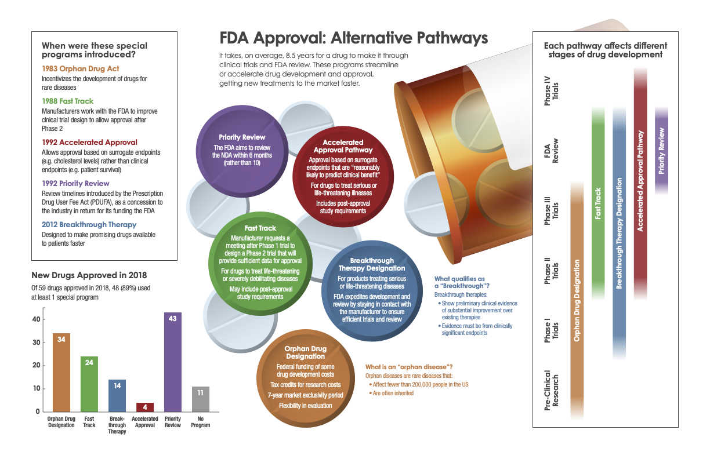
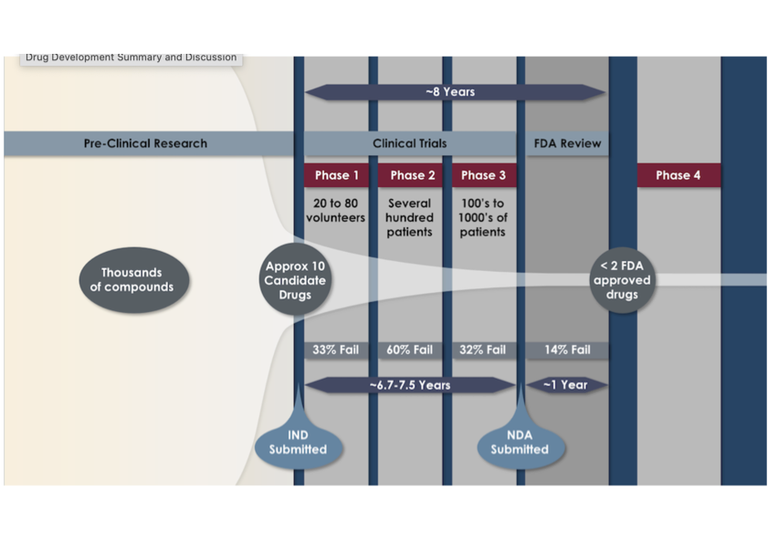
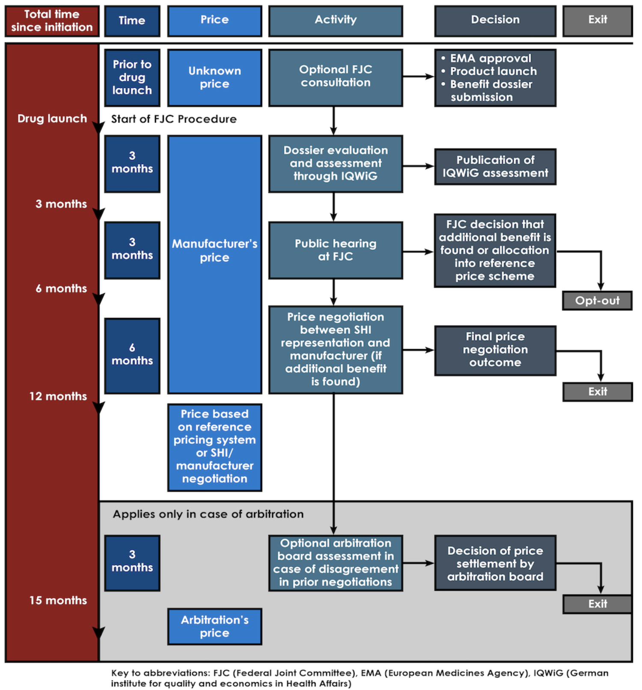

# Prescription Drug Regulation, Cost, and Access: Current Controversies in Context
## HarvardX 1962USRx Completed: 10/08/26
---
## Course Overview - ##
The six module course provided an introduction to the pharmaceutical market and regulation standard present in the United States as well as other countries, under the Food and Drug Administration (FDA), IQWiG (Germany), and NICE (UK). The relevant pathways to drug approval were discussed in detail, including alternative pathways like Fast-track and the Orphan Drug Designation. Drug pricing and marketing was also detailed in depth during the course, providing a new perspective for me as Direct to Consumer Advertising (DTCA) was something I was particularly unfamiliar with. The course helped me to understand the approach of Post-Approval Monitoring by the FDA as well as how liability is largely placed on manufacturers of the drugs rather than the regulators themselves. A detailed module on special classes of drugs and diseases also challenged me, diving into biologics vs biosimilars and the areas of priority when it comes to neglected tropical diseases and cancer treatments.      
--

 
 

# Designing a Balanced Expanded Access Framework: Protecting Integrity While Prioritising Patients 

> **Case Focus:** Designing your own framework for an expanded access program that balances need for medication with safety issues

As a policymaker, the central challenge in designing an Expanded Access (Compassionate Use) program is balancing rapid relief for terminally or severely ill patients with the need to generate robust, scientific evidence through randomised clinical trials (RCTs). To strike this balance, I propose a regulatory framework based on four core features:

1. **Phase I Safety Threshold**
To prevent patients from being exposed to outright toxic or ineffective compounds without baseline data, eligibility would require completion of initial Phase I safety/dosing trials. Additionally, to protect clinical trials, patients must be formally ineligible for, or unable to access, existing ongoing trials for that drug.

2. **"Safe Harbor" Real-World Data (RWD) Registry**
Manufacturers often hesitate to grant expanded access out of fear that adverse events in very sick patients will delay FDA approval. My program would create a Safe Harbor Data Protocol: adverse events occurring in expanded access would be reviewed in context (accounting for baseline disease severity) so they don't automatically stop a primary clinical trial. At the same time standardised outcomes data would be logged in a national registry to inform future research.

3. **Fast-Track Centralized Review Board**
To avoid bureaucracy and delays for time-sensitive cases, the program would utilize a single, dedicated National Expanded Access Ethics Board operating under a 72-hour turnaround window for single-patient requests, eliminating redundant institutional review board (IRB) delays.

4. **Direct-Cost Caps & Transparency**
Pharma sponsors would be permitted to charge patients or insurers only for the at-cost manufacturing and handling of the drug, preventing predatory pricing while ensuring small biotech firms are not driven into financial deficit by providing compassionate supply.

Final Discussion Post: 
-
The core issue is finding the right balance between giving patients the right to try medications that might save their lives and protecting them from the risks of untested, potentially harmful drugs. To manage this effectively, I propose a standardized, step-by-step process for the majority of cases: (1) verify that the patient has a life-threatening illness with no approved options remaining; (2) require the drug to have passed Phase 1 safety testing; (3) secure full informed consent through a fast-tracked ethics review; and (4) track patient outcomes in a registry without stalling the drug's primary clinical trial pipeline. Having this clear baseline procedure ensures requests are handled quickly, safely, and fairly, while keeping the framework flexible enough to adapt when unique or complex cases arise.

 

# FDA Approval Pathway Case Study: Desmopressin 

> **Case focus:** Approval or rejection process of a proposed new drug to be added to the market

Following this approval pathway we can use a case study to understand the process from a basic practical point of view. The case study follows how an application to market a new drug is processed and what statistics have been collected and submitted for approval. Here are the principle details that have been submitted in the case study for the approval of a new nasal spray formulation of desmopressin. A drug used to treat patients with nocturne, the need to wake at night to urinate. 
 

| Clinical Trial Feature | Details Submitted to FDA (Noctiva NDA) |
| :--- | :--- |
| **Number of Trials** | Data from 2 randomized trials submitted |
| **Study Design** | Randomized, Placebo-Controlled |
| **Primary Endpoints** | 1. Change in number of nocturia episodes after 12 weeks vs. baseline 2. Percentage of patients with a ≥50% reduction in nightly voiding episodes |
| **Inclusion Criteria** | • Age > 50 years • History of 2 or more episodes of nocturia per night |
| **Exclusion Criteria** | • Uncontrolled diabetes mellitus or hypertension • Congestive heart failure, nephrotic syndrome, or peripheral edema • Polydipsia or obstructive sleep apnea • History of urinary retention or neurogenic detrusor overactivity • Severe lower urinary tract symptoms (BPH, overactive bladder, severe stress incontinence) • Concomitant loop diuretics or glucocorticoids |
| **Participant Demographics** | • **Total:** 1,707 patients with nocturnal polyuria (waking 2+ times/night) • **Mean Age:** 66 years • **Sex:** 57% Male • **Race:** 78% Caucasian • **Comorbidities:** 60% had one or more underlying causes identified |

 

 

Summary of Clinical Trial Findings (FDA Submission)
-

Primary Benefits & Efficacy

| Metric | Findings & Group Comparison |
| :--- | :--- |
| **Episodes Per Night** | • **Baseline:** 3.3 episodes/night • **Placebo:** Decreased to 2.1 episodes/night • **High-Dose Desmopressin:** Decreased to 1.8 episodes/night • *Low-dose showed similar results to placebo.* |
| **≥ 50% Episode Reduction** | • **High-Dose Desmopressin:** 49% of patients achieved ≥50% reduction • **Placebo:** 30% of patients achieved ≥50% reduction • *Low-dose showed similar results to placebo.* |
| **Time to First Episode** | • **High-Dose Desmopressin:** Average 108 minutes before first wake • **Placebo:** Average 72 minutes before first wake (+36 min improvement) |
| **Quality of Life (0–100 Scale)** | • **High-Dose Desmopressin:** Improved by ~14 points • **Placebo:** Improved by ~12 points • *No significant difference seen between low-dose and placebo.* |

 

Safety Outcomes & Identified Risks

| Risk / Safety Parameter | Observed Clinical Outcomes |
| :--- | :--- |
| **Overall Hyponatremia Risk** | • **Placebo:** 4.6% (mild) • **Low-Dose Desmopressin:** 10.0% (mild, moderate, or severe) • **High-Dose Desmopressin:** 14.0% (mild, moderate, or severe) |
| **Severe Hyponatremia ($Na^+ \le 125\text{ mmol/L}$)** | • **High-Dose Desmopressin:** 5 patients • **Low-Dose Desmopressin:** 0 patients • **Placebo:** 1 patient |
| **Mortality / Deaths** | • **High-Dose Desmopressin:** 5 deaths (3 unrelated, 2 unclear relationship) • **Placebo:** 0 deaths |

 

Regulatory Analysis & FDA Non-Approval Rationale

Despite demonstrating a statistically significant reduction in nightly voiding episodes at the higher dose, the benefit-risk profile for this desmopressin formulation presents severe safety barriers under FDA regulatory standards. 

1. **Unfavorable Risk-Benefit Ratio:** The FDA must refuse NDA approval if the risk of disease or injury outweighs the drug's clinical benefit. While high-dose desmopressin delayed first-time nocturnal waking by an average of only 36 minutes over placebo, it caused a steep, dose-dependent rise in hyponatremia; increasing overall hyponatremia rates from **4.6% in placebo to 14.0%**, including **5 severe cases ($Na^+ \le 125\text{ mmol/L}$)** and **5 recorded deaths** in the treatment arm. 
2. **Subpopulation Vulnerability:** Nocturia predominantly affects elderly patients (mean age 66 in trials), a demographic highly susceptible to hyponatremia-induced confusion, falls, fractures, and seizures. 
3. **Efficacy Gaps in Lower Doses:** Attempts to mitigate toxicity using the lower dose resulted in efficacy outcomes that were virtually indistinguishable from placebo, eliminating a viable safe dosing window. 

Consequently, given that nocturia is a non-life-threatening quality-of-life condition, the FDA regulatory panel would likely determine that the modest clinical benefit does not justify exposing patients to life-threatening electrolyte imbalances, leading to a **Complete Response Letter (CRL)** or requiring restrictive **REMS (Risk Evaluation and Mitigation Strategies)** and Boxed Warnings if approved.

 
 

# Practical Takeaway: International Drug Pricing Reform (Germany's AMNOG System) 

> **Case Focus:** Evaluating Germany’s AMNOG framework (value-based pricing via IQWiG and G-BA) as a potential model for US prescription drug pricing reform.

### Overview of the German AMNOG Process
Passed in 2011, the Pharmaceutical Market Restructuring Act (AMNOG) introduced formal value-based price regulation for newly approved brand-name drugs in Germany:
1. **Free Launch Pricing (Year 1):** Manufacturers set the launch price for the first 12 months post-EMA approval.
2. **Formal Benefit Assessment:** IQWiG evaluates clinical effectiveness against pre-defined comparator therapies, leading to a 6-tier benefit categorization by the Federal Joint Committee (G-BA).
3. **Value-Based Price Negotiation:** If added benefit is proven, negotiations with the Statutory Health Insurance (SHI) umbrella organization determine a discounted price based on the comparator baseline. If no added benefit is demonstrated, the drug is assigned to a low-cost reference price group.
4. **Market Opt-Out Rights:** Manufacturers can withdraw the drug prior to publishing negotiated prices to avoid setting a low international reference price for other global markets.

 
  

Discussion: Why Early Market Exit Fears Did Not Materialize
-

 1. **High Commercial Value of the German Market**
Germany represents the largest pharmaceutical market in Europe. Completely opting out means forfeiting substantial revenue from over 73 million individuals covered by Statutory Health Insurance (SHI), making market withdrawal financially disadvantageous for most commercial sponsors.

2. **High Success Rate for Truly Innovative Drugs**
Data shows that drugs receiving a positive clinical benefit rating (major, considerable, or minor added benefit) overwhelmingly remain on the market. AMNOG does not penalize true therapeutic innovation; it specifically targets "me-too" drugs that offer no clinical superiority over existing, lower-cost alternatives.

3. **Strategic Realism in Global Reference Pricing**
While sponsors fear that a lower negotiated German price will depress international reference prices (IRP) in other countries, completely withdrawing a drug from Germany forfeits European market share without guaranteeing higher pricing elsewhere. Negotiating a reasonable, value-backed price remains more profitable than total market exit.

Forum Post: Drug Pricing Reform – The German AMNOG System
-
**Comparison with the US System**
* **Pricing Autonomy vs. Regulation:** In the US, drug manufacturers freely set list prices and negotiate private, fragmented rebates with individual insurers and Pharmacy Benefit Managers (PBMs). In Germany, while manufacturers can set the initial price freely during the first year, AMNOG mandates a formal comparative clinical assessment to determine price caps or negotiated rates thereafter.
* **Value Assessment Framework:** Germany utilizes a centralized, transparent evaluation process through IQWiG and the Federal Joint Committee (FJC) to link a drug's price directly to its demonstrated clinical added value over existing therapies. The US lacks a single national body for health technology assessment, resulting in high price variance and limited leverage to tie cost directly to added clinical value.

**Potential Risks of the German System**
* **Reduced Availability of Certain Therapies:** If the FJC deems a drug to have "no added benefit," placing it in a low-cost reference price group, a manufacturer may choose to opt out and exit the market, restricting access for patients who might have responded to that specific therapy.
* **Global Reference Pricing Spillover:** Because other nations reference published German drug prices, manufacturers face global revenue risk. A low negotiated price in Germany can lower prices worldwide, creating a strong commercial incentive for pharmaceutical companies to withdraw lower-tier drugs rather than accept a reduced rate.

**Why Early Fears of Mass Market Exits Have Not Materialised**
* **Strong Incentives for Genuine Innovation:** Drugs that demonstrate clear clinical improvement (major, considerable, or minor added benefit) receive positive assessments, placing manufacturers in a strong negotiating position to secure fair, profitable long-term prices.
* **12-Month Unrestricted Launch Window:** The ability to sell at the manufacturer's chosen list price during the initial 12 months allows companies to establish immediate market presence, build patient volume, and generate revenue before negotiated prices take effect.
* **Targeted Exits Reserved for Redundant Drugs:** Mass exits have not occurred because market withdrawal is primarily limited to drugs showing no clinical superiority over existing, cheaper alternatives. For truly innovative therapies, the financial returns within the German market remain sufficiently attractive to stay.

  
 

# Progress Page as Evidence of Completion

!(progress-page.png)

