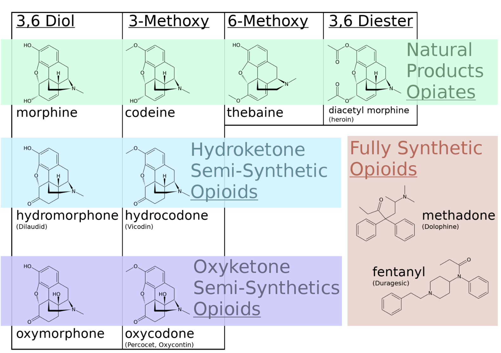
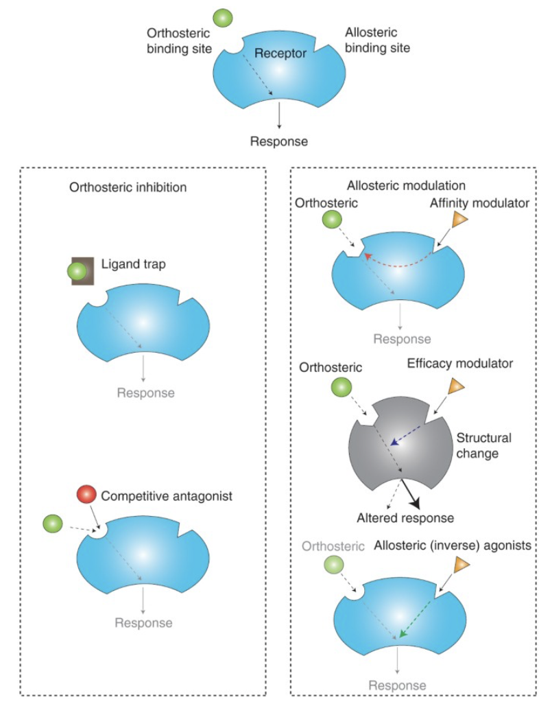
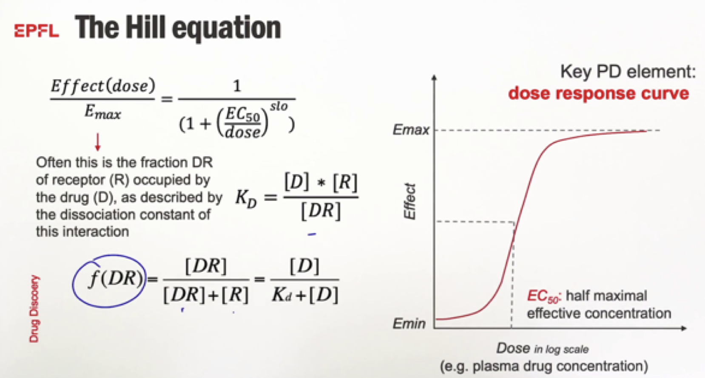
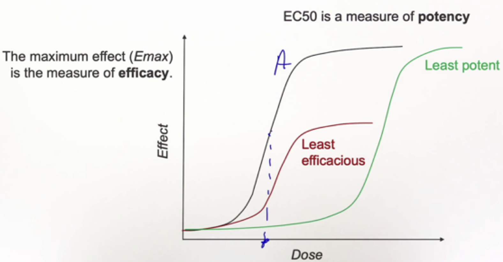

# Introduction to Drug Discovery
## EPFLx drug-discovery Completed: In Progress

 
 

## Week 1: Pharmacology Basics ##
---
Objectives
-
* Introduction to and acquisition of basic knowledge of pharmacology and drug-receptor interactions
* Introduction to and acquisition of basic knowledge of pharmacokinetics and toxicology
* Introduction to and acquisition of basic knowledge of drug metabolism and phase I/II reactions
 
Pharmacology- The study of interactions between living organisms and chemicals affecting their physio-pathology. 

**Pharmacokinetics:**
* Administration
* Absorption
* Distribution: Metabolism / Elimination

**Pharmacodynamics:**
* Target Binding: Affinity / Avidity
* Mechanism of Action
* Response: Efficacy

 
Opioids are the classic example of binding affinity playing a major role in dosage and effects of drugs. Opioids bind to the same receptor but have largely different binding affinities causing different responses, this is most apparent in fully synthetic opioids that have a somewhat different structure to members of the opiate family (naturally derived from the poppy plant). 

 
 

An interesting journal article briefly mentioned in the course: "Allosteric targeting of receptor tyrosine kinases" piqued my interest, particularly sections on orthosteric vs allosteric receptor mechanisms as shown in the figure below:

 

Briefly, there are three main types of allosteric modulators: (allosteric ligands are structurally different to orthosteric ones and bind at a different site to modulate the properties of the orthosteric ligands)
* **Affinity Modulators-** That alter the ortho binding site and kinetics of binding, therefore the binding affinity, without changing the signalling properties of the receptor
* **Efficacy Modulators-** Which induce a change in the conformation of the receptor to alter the signalling ability of the orthosteric ligand with possible effects on the affinity
* **Allosteric Agonists-** Or inverse agonists, which change the receptor signalling in the absence of an orthosteric ligand and alter the response of the receptor

**The Hill Equation and Dissociation Constant**

<table>
  <tr>
    <td align="center" valign="top">
      
    </td>
    <td align="center" valign="top">
      
    </td>
  </tr>
</table>
  
The EC50, or half the maximum possible effective concentration, is a measure of drug potency and is used to determine the Hill Equation as shown above in the dose response curves. These curves give information and are useful tools to determine molecular information, the dissociation constant (KD), and a measure of potency/efficacy of a drug.  

